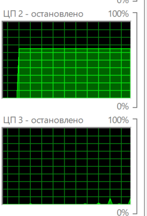

# Исследовательская работа по оптимизации вычислений необходимых для построения множества Мандельброта

## Описание
В проекте реализовано построение множества Мандельброта с графической визуализацией.

Поскольку вычисление множества требует значительных вычислительных ресурсов, основной акцент сделан на оптимизации производительности. Были исследованы подходы, позволяющие кратно ускорить вычисления.

Ключевое ускорение достигается за счёт использования SIMD-инструкций (AVX512), которые позволяют обрабатывать несколько значений за одну операцию. Для этого применяются intrinsics — функции, напрямую отображающиеся в инструкции процессора и дающие полный контроль над векторными вычислениями.
 
Работа выполнена на языке **C**, использует графическую библиотеку **TXLib** для визуализации. Собирается при помощи **g++** под **Windows 11**.

Разработка и тестирование велась на процессоре **AMD Ryzen 7 8845H** с поддержкой **AVX512**.

## Измерения производительности
### Подготовка системы к тесту.
- Для создания единообразной среды для проведения измерений зафиксируем процесс и потоки исследуемой программы на одном **ядре CPU**. В операционной системе **Windows** нельзя полностью изолировать ядро от обработки прерываний. Будем пытаться приблизиться к этому условию. Ядро выбираем с наименьшей загруженностью. В **Windows** значительная часть системных задача выполняется на ядре 0, поэтому стоит выбирать из других.
 Для этого проанализируем графики по загруженности ядер. 

 

Видно, что ядро 2 фактически не используется системой и другими приложениями, поэтому погрешность вносимая данным фактором не будет играть роли. Поскольку в действительности 2 и 3 логические ядра у процессора **AMD Ryzen 7 8845H**  являются одним физическим ядром, необходимо убедиться, что нагрузка на 3 логическое также минимальна.


Нагрузка на 3 ядро минимально следовательно влияние на результаты **SMT (Hyper-Threading)** сведено к нулю.

Присвоим процессу и потокам исследуемой программы конкретное ядро для добавим в начале **C** программы эти строчки из заголовочного файла **<windows.h>** :
```C
SetProcessAffinityMask(GetCurrentProcess(), 1 << 2);
SetThreadAffinityMask (GetCurrentThread(),  1 << 2);
```
Номер ядра задается при помощи установки соответствующего бита в аргументе-маске. 

- Для уменьшения вероятности, что исследуемый процесс будет вытеснен системой с ядра - установим приоритет исследуемого процесса и его потоков максимально высоким.

Для этого в начало программы добавим эти строчки:
```C
SetPriorityClass(GetCurrentProcess(), HIGH_PRIORITY_CLASS);
SetThreadPriority(GetCurrentThread(), THREAD_PRIORITY_HIGHEST);
``` 
- Для минимизации попадание на ядро сторонних процессов все сторонние приложения во время теста были закрыты. 
- Для более стабильной работы процессора и уменьшения скачков частоты был включен **performance Mode**. Частично отключает **C-states**, который может понижать частоту работы процессора.
Как включить:
1. нажать **WIN+R**
2. ввести powercfg.cpl

3. Далее нажать "настройки схемы электропитания" 

4. Затем изменить дополнительные параметры схемы питания.

5. И в этом окне вместо сбалансировано выбрать "высокая производительность" 

На моем ноутбуке изменение режима электропитания таким способом недоступно, поэтому я изменил его через софт производителя(Lenovo).


- **Precision Boost**(у Intel - turbo Boost) отключил так он в свою очередь уменьшает стабильность работы процессора и от запуска к запуска частота из-за него будет скакать.
Как выключить:
1. Аналогично доходим до изменения дополнительных параметров изменения схемы электропитания.
2. Нажимаем "управление электропитанием процессора" -> максимальное состояние процессора. 
3. Устанавливаем "От батареи" в 99%.


### Фиксация параметров системы и аппаратных средств. 
- Измерения проводились при подключении ноутбука к сети электропитания.
- У процессора **AMD Ryzen 7 8845H** отсутствуют датчики температуры на CPU(тем более на конкретных ядрах), поэтому зафиксируем температуру на встроенном графическом адаптере и примем ее за температуру процессора благодаря их близкому физическому расположению.
- t = $34^\circ$, частота процессора колеблется в диапазоне 2.31-2.42 ГГц.  


### Выполнение измерений
#### Ускоренная версия
- Для того, чтобы "холодный запуск" , а также погрешность вносимая случайными факторами была минимальна измерения проведены **50 раз**. Одно измерение включает в себя проведение всех необходимых вычислений для построения в окне 800*600 пикселей множества Манедльброта с максимальным число итераций для одной точки **256**. За одно измерение происходит вычисление для **1000 кадров**.
- Проводилось измерение именно скорости вычислений. Для этого во время теста множество не визуализировалось. Также результаты не сохранялись в память. 
- Компиляция производилась с опцией -O3. Чтобы компилятор не удалил весь блок с вычислений в связи с отсутствием побочных эффектов в код была добавлена "обманка" не позволяющая компилятору произвести подобную оптимизацию:
```C
asm volatile("" :: "v"(exitIndexes));
```
Эта инструкция не добавляет в машинный код никаких инструкций, а следовательно не влияет на результаты измерений. Т.к. блок объявлен с директивой `volatile` компилятор не может удалить или переместить. И т.к. он для компилятора представляется зависимым от результатов вычислений, поэтому блок кода с ними не удаляется. 

- Измерялось время при помощи высокоточной функции `QueryPerformanceCounter` <windows.h>. Точность до микросекунд(даже наносекунд) достигается за счёт использования ею аппаратного счетчика **TSP** процессора. Для перевода в секунды полученного значения используется частота счетчика полученная при помощи `QueryPerformanceFrequency`. Частота постоянна для каждого запуска системы.

- Загрузка ядра во время измерения: 

- таблица с результатами проведенных измерений:
$$
\begin{array}{|c|c|c|}
\hline
\text{Номер теста} & \text{время, с} & \text{погрешность, с}  & \text{$\xi$ (\%)} \\ \hline
1 & 11.69 & 0.00 & 0.00  \\ \hline
2 & 11.68 & 0.01 & 0.086 \\ \hline
3 & 11.67 & 0.02 & 0.171 \\ \hline
4 & 11.65 & 0.04 & 0.343 \\ \hline
5 & 11.65 & 0.04 & 0.343 \\ \hline
\vdots & \vdots & \vdots & \vdots \\ \hline
50 & 11.67 & 0.02 & 0.171 \\ \hline
\text{Среднее:} & 11.69 & 0.02 & 0.171 \\ \hline
\end{array}
$$
- Анализ полученной погрешности показывает, что влияние случайных факторов было в значительной степени нивелировано, ведь погрешность составила всего **0.171%**.
#### Базовая версия
В этих же условиях были проведены измерения для самой начальной версии с просчетом по отдельности каждого пикселя(функция `basicVersionCalculations`).
$$
\begin{array}{|c|c|c|c|}
\hline
\text{Номер теста} & \text{время, с} & \text{погрешность, с} & \xi \text{ (\%)} \\ \hline
1  & 165.48 & 0.16 & 0.097 \\ \hline
2  & 165.51 & 0.13 & 0.079 \\ \hline
3  & 165.48 & 0.16 & 0.097 \\ \hline
4  & 165.49 & 0.15 & 0.091 \\ \hline
5  & 165.49 & 0.15 & 0.091 \\ \hline
6  & 165.61 & 0.03 & 0.018 \\ \hline
7  & 165.82 & 0.18 & 0.109 \\ \hline
8  & 165.80 & 0.16 & 0.097 \\ \hline
9  & 165.85 & 0.21 & 0.127 \\ \hline
10 & 165.83 & 0.19 & 0.115 \\ \hline
\text{Среднее:} & 165.64 & 0.15 & 0.091 \\ \hline
\end{array}
$$

Было проведено 10 измерений и даже при этом вышла погрешность всего 0,0.091%, что позволяет говорить о релевантности полученных данных. 


#### Сравнение полученных результатов
$$
\begin{array}{|l|c|c|c|}
\hline
\text{Параметр сравнения} & \text{ускоренная версия} & \text{базовая версия} & \text{Различие} \\ \hline
\text{Среднее время, с} & 11.69 & 165.64 & 14.17 \\ \hline
\text{Средняя абс. погрешность, с} & 0.02 & 0.15 & +0.13 \\ \hline
\text{Относит. погрешность } \xi \text{ (\%)} & 0.171\% & 0.091\% & -0.080\% \\ \hline
\end{array}
$$

### Вывод 
Было достигнуто ускорение в 14.17 $\pm$ 0.13 раз, что является отличным результатом.
