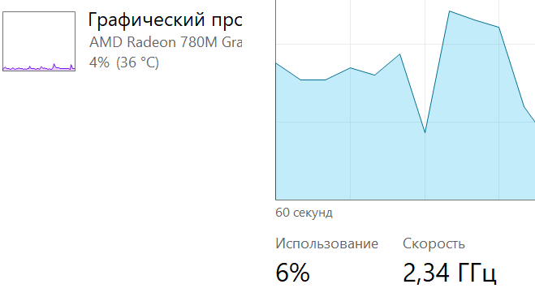

# Исследовательская работа по оптимизации вычислений необходимых для построения множества Мандельброта

## Описание
В проекте реализовано построение множества Мандельброта с графической визуализацией.

Поскольку вычисление множества требует значительных вычислительных ресурсов, основной акцент сделан на оптимизации производительности. Были исследованы подходы, позволяющие кратно ускорить вычисления.

Ключевое ускорение достигается за счёт использования SIMD-инструкций (AVX512), которые позволяют обрабатывать несколько значений за одну операцию. Для этого применяются intrinsics — функции, напрямую отображающиеся в инструкции процессора и дающие полный контроль над векторными вычислениями.
 
Работа выполнена на языке **C**, использует графическую библиотеку **TXLib** для визуализации. Собирается при помощи **g++** под **Windows 11**.

Разработка и тестирование велась на процессоре **AMD Ryzen 7 8845H** с поддержкой **AVX512**.

## Построение множества Мандельброта
### Математическая модель 
Множество Мандельброта — это множество точек комплексной плоскости, для которых последовательность, заданная рекуррентным соотношением $$z_{n+1} = z_n^2 + c, \quad z_0 = 0$$ остаётся ограниченной.

### Алгоритм построения  
Для каждой точки **c** на комплексной плоскости:
1. Итеративно вычисляется последовательность $z_n$
2. На каждом шаге проверяется модуль $|z_n|$
3. Если $|z_n| > M$, вычисления прекращаются

    - Если превышение произошло — точка **не принадлежит** множеству
    - Если за **N** итераций превышения не произошло — точка считается **принадлежащей** множеству  

#### Замечания
- Если $|z_n| > M$ достигается раньше, чем за **N** итераций, дальнейшие вычисления для точки прекращаются 
- В реализации использовались значения:
    - **M = 2** — при $|z_n| > 2$ последовательность гарантированно расходится
    - **N = 256** — на практике этого достаточно, чтобы определить принадлежность точки в большинстве случаев

### Графическая визуализация
Для визуализации использовалась библиотека **TXLib**.

#### Инициализация окна и буфера

- Создание окна:
```C
txCreateWindow(WIDTH_WINDOW, HEIGHT_WINDOW);
```   
- Получение указателя на видеобуфер:
```C
videoMemBuffer = txVideoMemory();
```
- Видеобуфер представляет собой двумерный массив пикселей, соответствующий размеру окна. Каждый пиксель хранится в формате **RGBA**:
    - красный (R)
    - зелёный (G)
    - синий (B)
    - прозрачность (A)

Прямой доступ к памяти позволяет значительно ускорить отрисовку.

#### Оптимизация отрисовки

- Для устранения мерцания отключается автоматическое обновление окна:
```C
txLock();
```
- После завершения записи в буфер обновление включается обратно:
```C
txUnlock();
```

- После обработки всех пикселей окно обновляется:
```C
txRedrawWindow();
```

#### Отображение множества
Для каждого пикселя:
- вычисляется поведение последовательности $z_n$
- Цвет определяется числом итераций до превышения порога **M**
 
#### Пример визуализации
<p align="center">
  
</p>

## Измерения производительности
### Подготовка среды
- Все измерения проводились в контролируемых условиях для обеспечения воспроизводимости

- Процесс фиксировался на одном ядре CPU (включая выполняющий поток):
```C
SetProcessAffinityMask(GetCurrentProcess(), 1 << 2);
SetThreadAffinityMask(GetCurrentThread(), 1 << 2);
```
- Использовалось наименее загруженное ядро (ядро 0 не рассматривалось, так как активно используется системой):

- Учитывалось влияние SMT (Hyper-Threading) — проверялась загрузка парного логического ядра (того же физического)

<p align="center">
  
  
</p>

- Для процесса и потока устанавливался максимальный приоритет:
```C
SetPriorityClass(GetCurrentProcess(), HIGH_PRIORITY_CLASS);
SetThreadPriority(GetCurrentThread(), THREAD_PRIORITY_HIGHEST);
``` 

- Все сторонние приложения во время тестов были закрыты

### Настройки процессора
Для стабилизации частоты и уменьшения вариативности измерений:
- Включён режим высокой производительности
- Отключён Precision Boost (AMD) / Turbo Boost (Intel)
- Минимизировалось влияние **C-states**

Подробная настройка системы описана в [report.md](report.md)

### Параметры системы
- Устройство: ноутбук с процессором **AMD Ryzen 7 8845H**
- Питание: от сети
- Температура: ~34 °C (по встроенному графическому адаптеру)
- Частота CPU: 2.31–2.42 ГГц

<p align="center">
  
</p>

### Проведение измерений
#### Итог

Оптимизированная версия (SIMD / AVX512) показывает ускорение:

> **≈ 14.2× быстрее базовой реализации**

---

#### Условия измерений

Условия соответствуют описанным в предыдущем разделе:

- Количество запусков: **50** (для снижения влияния случайных факторов)
- Разрешение: **800×600**
- Максимальное число итераций: **256**
- 1000 кадров на одно измерение
- Визуализация и сохранение результатов отключены (измеряется только время вычислений)
- Компиляция: **-O3**

Для предотвращения удаления вычислений компилятором (из-за отсутствия побочных эффектов) использовалась «заглушка»:

```C
asm volatile("" :: "v"(exitIndexes));
```
Эта инструкция не генерирует машинный код, но препятствует удалению вычислительного блока компилятором.

#### Метод измерения

Измерение времени выполнялось с использованием функции `QueryPerformanceCounter` из `<windows.h>`.

Функция основана на аппаратном счётчике **TSC (Time Stamp Counter)** и обеспечивает высокую точность измерений (до микросекунд и ниже).
Для перевода значений в секунды использовалась `QueryPerformanceFrequency`.

### Результаты
#### SIMD (AVX512) версия
- Среднее время выполнения: 11.69 с
- Абсолютная погрешность: 0.02 с
- Относительная погрешность: 0.171%

#### Базовая версия
- Среднее время выполнения: 165.64 с
- Абсолютная погрешность: 0.15 с
- Относительная погрешность: 0.091%

### Сравнение 

| Метрика                      | SIMD версия | Базовая версия |
|:-----------------------------|:-----------:|:--------------:|
| Среднее время (с)            | 11.69       | 165.64         |
| Ускорение                    | **×14.17**  | —              |
| Относительная погрешность (%)| 0.171       | 0.091          |

### Вывод

Использование SIMD-инструкций (AVX512) позволило добиться значительного ускорения вычислений (более чем в 14 раз) при сохранении высокой стабильности результатов.

Низкая относительная погрешность (< 0.2%) подтверждает, что влияние случайных факторов было эффективно минимизировано.