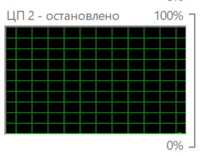
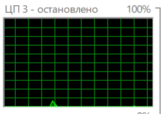
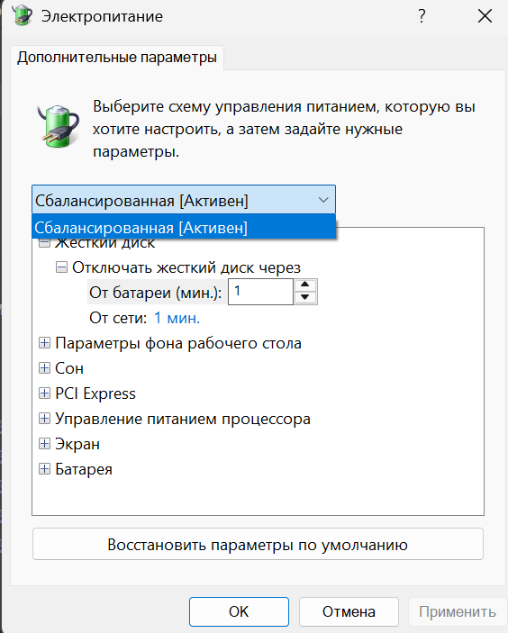
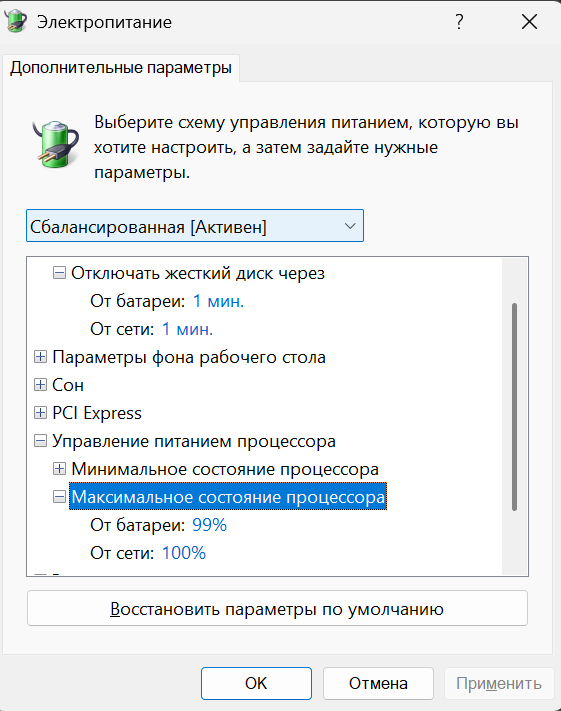

# Исследовательская работа по оптимизации вычислений необходимых для построения множества Мандельброта

## Описание
В проекте реализовано построение множества Мандельброта с графической визуализацией.

Поскольку вычисление множества требует значительных вычислительных ресурсов, основной акцент сделан на оптимизации производительности. Были исследованы подходы, позволяющие кратно ускорить вычисления.

Ключевое ускорение достигается за счёт использования SIMD-инструкций (AVX512), которые позволяют обрабатывать несколько значений за одну операцию. Для этого применяются intrinsics — функции, напрямую отображающиеся в инструкции процессора и дающие полный контроль над векторными вычислениями.
 
Работа выполнена на языке **C**, использует графическую библиотеку **TXLib** для визуализации. Собирается при помощи **g++** под **Windows 11**.

Разработка и тестирование велась на процессоре **AMD Ryzen 7 8845H** с поддержкой **AVX512**.

## Измерения производительности
### Подготовка системы к тесту.
- Для создания единообразной среды для проведения измерений зафиксируем процесс и потоки исследуемой программы на одном **ядре CPU**. В операционной системе **Windows** нельзя полностью изолировать ядро от обработки прерываний. Будем пытаться приблизиться к этому условию. Ядро выбираем с наименьшей загруженностью. В **Windows** значительная часть системных задача выполняется на ядре 0, поэтому стоит выбирать из других.
 Для этого проанализируем графики по загруженности ядер. 

 

Видно, что ядро 2 фактически не используется системой и другими приложениями, поэтому погрешность вносимая данным фактором не будет играть роли. Поскольку в действительности 2 и 3 логические ядра у процессора **AMD Ryzen 7 8845H**  являются одним физическим ядром, необходимо убедиться, что нагрузка на 3 логическое также минимальна.



Нагрузка на 3 ядро минимально следовательно влияние на результаты **SMT (Hyper-Threading)** сведено к нулю.

Присвоим процессу и потокам исследуемой программы конкретное ядро для добавим в начале **C** программы эти строчки из заголовочного файла **<windows.h>** :
```C
SetProcessAffinityMask(GetCurrentProcess(), 1 << 2);
SetThreadAffinityMask (GetCurrentThread(),  1 << 2);
```
Номер ядра задается при помощи установки соответствующего бита в аргументе-маске. 

- Для уменьшения вероятности, что исследуемый процесс будет вытеснен системой с ядра - установим приоритет исследуемого процесса и его потоков максимально высоким.

Для этого в начало программы добавим эти строчки:
```C
SetPriorityClass(GetCurrentProcess(), HIGH_PRIORITY_CLASS);
SetThreadPriority(GetCurrentThread(), THREAD_PRIORITY_HIGHEST);
``` 
- Для минимизации попадание на ядро сторонних процессов все сторонние приложения во время теста были закрыты. 
- Для более стабильной работы процессора и уменьшения скачков частоты был включен **performance Mode**. Частично отключает **C-states**, который может понижать частоту работы процессора.
Как включить:
1. нажать **WIN+R**
2. ввести powercfg.cpl

3. Далее нажать "настройки схемы электропитания" 

4. Затем изменить дополнительные параметры схемы питания.

5. И в этом окне вместо сбалансировано выбрать "высокая производительность" 

На моем ноутбуке изменение режима электропитания таким способом недоступно, поэтому я изменил его через софт производителя(Lenovo).


- **Precision Boost**(у Intel - turbo Boost) отключил так он в свою очередь уменьшает стабильность работы процессора и от запуска к запуска частота из-за него будет скакать.
Как выключить:
1. Аналогично доходим до изменения дополнительных параметров изменения схемы электропитания.
2. Нажимаем "управление электропитанием процессора" -> максимальное состояние процессора. 
3. Устанавливаем "От батареи" в 99%.


### Фиксация параметров системы и аппаратных средств. 
- Измерения проводились при подключении ноутбука к сети электропитания.
- У процессора **AMD Ryzen 7 8845H** отсутствуют датчики температуры на CPU(тем более на конкретных ядрах), поэтому зафиксируем температуру на встроенном графическом адаптере и примем ее за температуру процессора благодаря их близкому физическому расположению.
- t = $34^\circ$, частота процессора колеблется в диапазоне 2.31-2.42 ГГц.  
